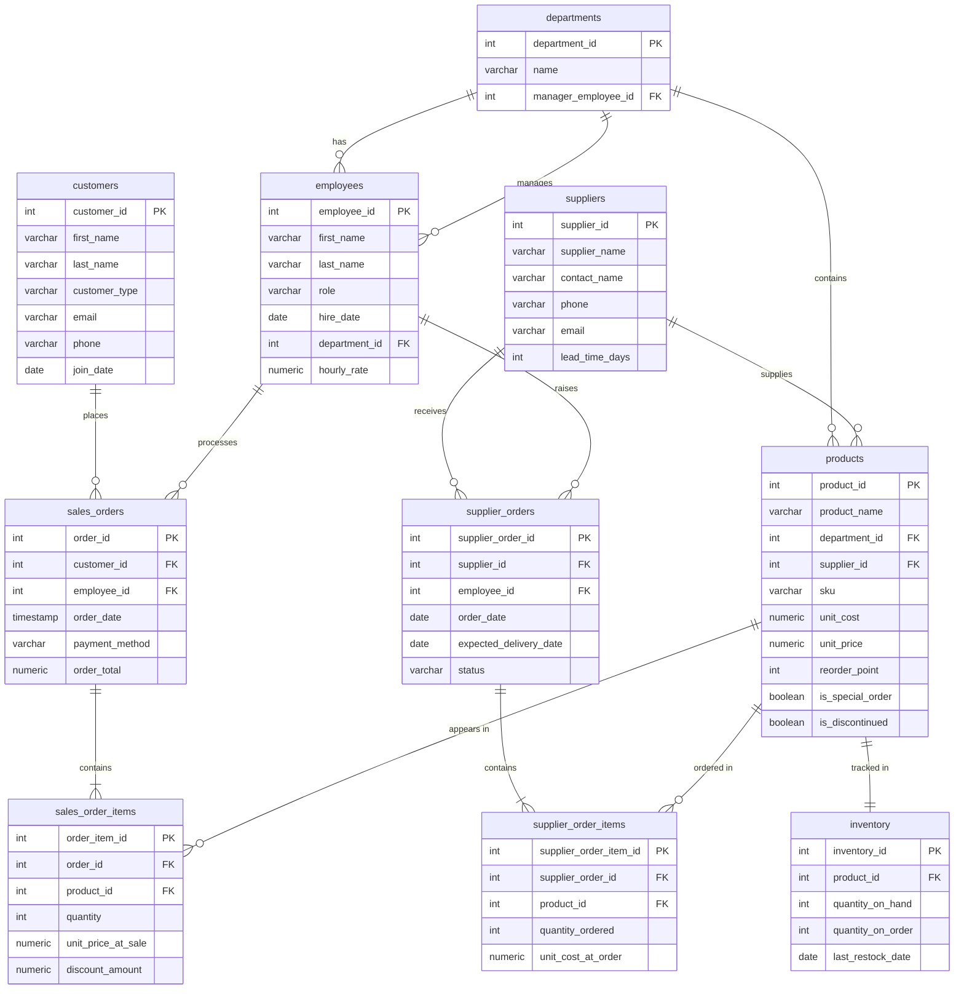

# LK Hardware Store: PostgreSQL Analytics Project

This repository contains a fully modeled PostgreSQL database simulating a mid-sized hardware store,
built for practicing SQL analytics and KPI development.

## 📚 Project Overview

This database includes:

- A relational schema with **foreign keys**, **normalized tables**, and **realistic business logic**
    
- Dummy data with **seasonality**, **price variation**, **bulk discounts**, and **inventory dynamics**
    
- Support for advanced KPIs across **sales**, **inventory**, **profitability**, **suppliers**, and **customers**
    
- A foundation for BI dashboards (Tableau, Power BI, Looker, Metabase)
    
# ERD

## Files
- `hardware_store.sql` — full schema + dummy data
- `sales_kpis.sql` — sales analytics queries
- `inventory_kpis.sql` — inventory analytics queries
- 
# 📊 KPI Coverage

The dataset is intentionally designed to support a wide range of business KPIs.

## 🛒 **Sales KPIs**

- **Total revenue**
    
- **Revenue by department**
    
- **Revenue by product**
    
- **Revenue by customer type** (Homeowner, Contractor, Business)
    
- **Average order value (AOV)**
    
- **Top 10 products by sales**
    
- **Seasonal sales trends** (Spring lumber spikes, Summer paint, Winter heating, etc.)
    
- **Employee sales performance**
    

## 📦 **Inventory KPIs**

- **Stockout rate**
    
- **Overstock rate**
    
- **Inventory turnover**
    
- **Days of inventory on hand (DOH)**
    
- **Reorder point breaches**
    
- **Supplier lead time accuracy**
    

## 🧮 **Profitability KPIs**

- **Gross margin by product**
    
- **Gross margin by department**
    
- **Loss leaders**
    
- **High‑margin vs low‑margin product mix**
    

## 🛠️ **Supplier KPIs**

- **On‑time delivery rate**
    
- **Cost variance over time**
    
- **Supplier dependency**
    
    - % of SKUs sourced from each supplier
        

## 🧑‍🤝‍🧑 **Customer KPIs**

- **Customer lifetime value (CLV)**
    
- **Repeat purchase rate**
    
- **Contractor vs homeowner revenue mix**
    
- **Basket composition**
    
    - Frequent item combinations (market basket analysis)
        

# 🔍 Special Analytical Features

The dummy data includes realistic business behaviors to make analysis meaningful:

✔ **Seasonal demand patterns**
    
✔ **Price changes over time**
    
✔ **Discontinued products still appearing in historical orders**
    
✔ **Special‑order items with long supplier lead times**
    
✔ **Contractors receiving bulk discounts**
    
✔ **Inventory shortages triggering supplier orders**
    
✔ **Employee performance variance**
    
✔ **High‑sales / low‑margin items**
    
✔ **Low‑sales / high‑margin items**
    

These features allow analysts to explore real‑world scenarios such as forecasting, anomaly detection, and profitability optimization.

# 🧱 Schema Summary

The database includes the following core tables:

- **departments**
    
- **employees**
    
- **suppliers**
    
- **products**
    
- **inventory**
    
- **customers**
    
- **sales_orders**
    
- **sales_order_items**
    
- **supplier_orders**
    
- **supplier_order_items**
    

Each table includes primary keys, foreign keys, and realistic data types.
